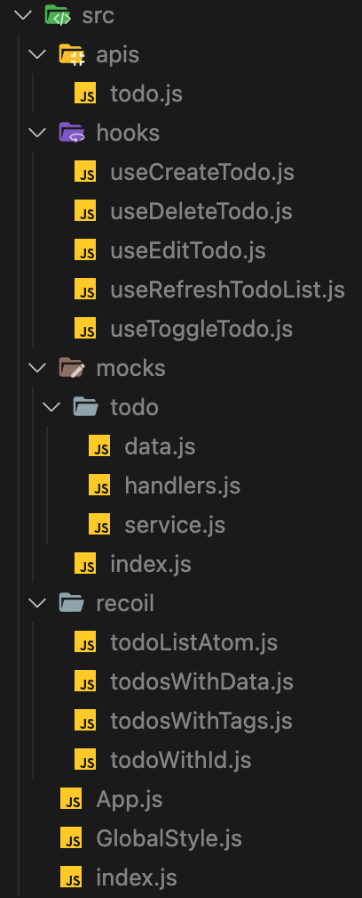
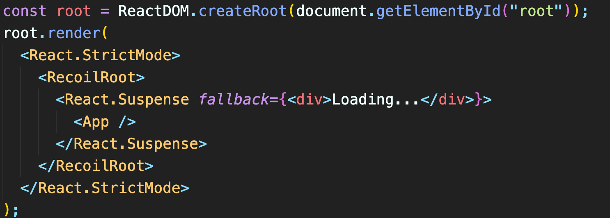

## Motivation

- msw.js를 사용하여 모킹 API와 데이터를 만들고 사용했습니다.
- 리액트 훅, 리코일 atom/selector를 사용하여 데이터 흐름 함수들을 모듈화 했습니다.

 

## Key Changes

- src/ apis, hooks, mocks, recoil 폴더가 생성되었습니다.
- src/index.js가 변경되었습니다. (React.Suspense)

### 스크린샷

src 폴더 스크린샷

- 

index.js 스크린샷

- 

 

## To Reviewers

- JS, React 로직 오류나 잘못된 코딩 습관(변수명 등)을 중점으로 보면서 검토해주세요
- 깃 커밋메세지 등 커뮤니케이션에 문제가 있는지 알려주세요
